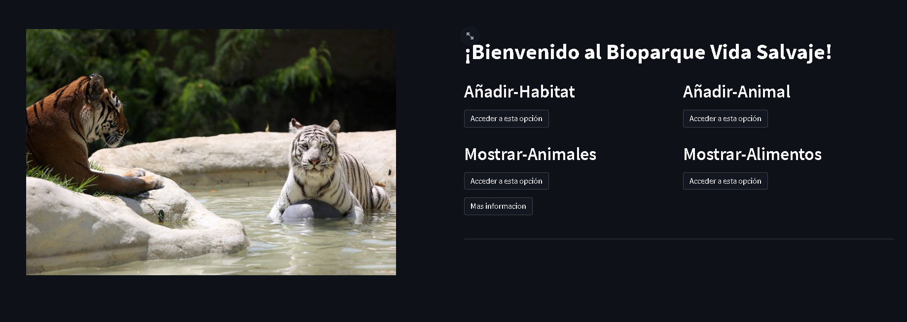
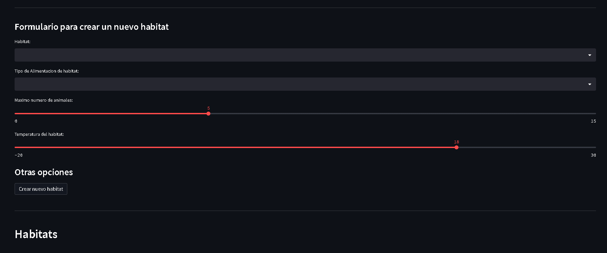
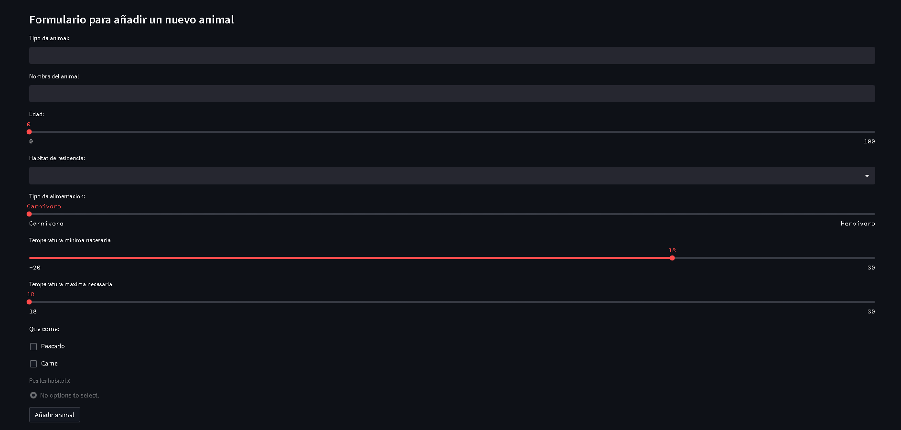
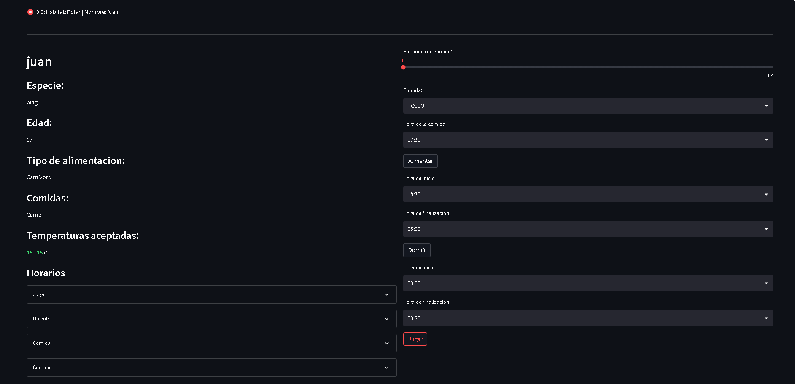
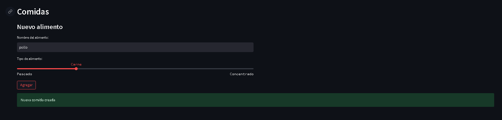

# Proyecto de Simulación de Zoológico

- https://lucid.app/lucidspark/5cabdea8-3511-4154-9a18-b69ef1d07f41/edit?viewport_loc=-1071%2C-1630%2C1920%2C937%2C0_0&invitationId=inv_8f9d545f-cbb4-4ab5-b230-3bed8ba6559d

Este proyecto tiene como objetivo simular el funcionamiento de un zoológico utilizando el lenguaje de programación Python y los conceptos de programación orientada a objetos. El programa incluye la creación de clases, relaciones, herencia, sobrescritura de métodos, sobrecarga de métodos, modificadores de acceso e interfaces gráficas de usuario.

El zoológico se compone de diferentes hábitats, cada uno de los cuales puede contener varios animales. Cada animal tiene un nombre, especie y hábitat al que pertenece, entre otros atributos.

El programa permite a los usuarios realizar las siguientes acciones:

1. Crear animales en el registro del zoológico.
2. Añadir un nuevo hábitat al zoológico. Los tipos de hábitat predefinidos son desértico, selvático, polar y acuático. Cada hábitat proporciona información como el número de animales asignados, temperatura y dieta. No se permite asignar un animal si no cumple con las condiciones del hábitat o si no hay espacio disponible. Además, cada hábitat tiene al menos dos atributos específicos.
3. Añadir un nuevo animal a un hábitat existente, asegurando que el hábitat exista y pueda albergar el tipo de animal, teniendo en cuenta las condiciones del hábitat y la disponibilidad.
4. Listar todos los hábitats del zoológico y sus respectivos animales. Los usuarios pueden ver información sobre los animales, como nombre, edad, tipo de alimentación, estado de salud y cualquier otro atributo agregado.
5. Realizar una acción específica para un animal en particular (dar órdenes al animal). Los usuarios proporcionan el identificador del animal y el nombre de la acción. Las acciones disponibles para los animales incluyen comer (validando la lista de alimentos aprobados para cada tipo de dieta), dormir (validando las horas de sueño requeridas) y jugar (verificando si el animal ya ha jugado en el día).
6. Permitir a los usuarios agregar y editar diferentes tipos de alimentos para los animales en el zoológico. Los animales tienen diferentes tipos de alimentación según su dieta: carnívoros, herbívoros y omnívoros.
7. Obtener información relevante para el zoológico realizando una consulta a través de una API.
8. El programa debe manejar errores de entrada y salida. Por ejemplo, si el usuario intenta ingresar una edad no válida para un animal, el programa debe informar al usuario del error y solicitar que ingrese una edad válida.

El programa debe ser implementado en la nube, aprovechando las características de Streamlit para facilitar este proceso.

Los estudiantes deben entregar un código Python completo que implemente todas las funcionalidades especificadas. El proyecto será evaluado en función de la calidad del código, la implementación de los conceptos de programación orientada a objetos, la funcionalidad del programa y la documentación.

